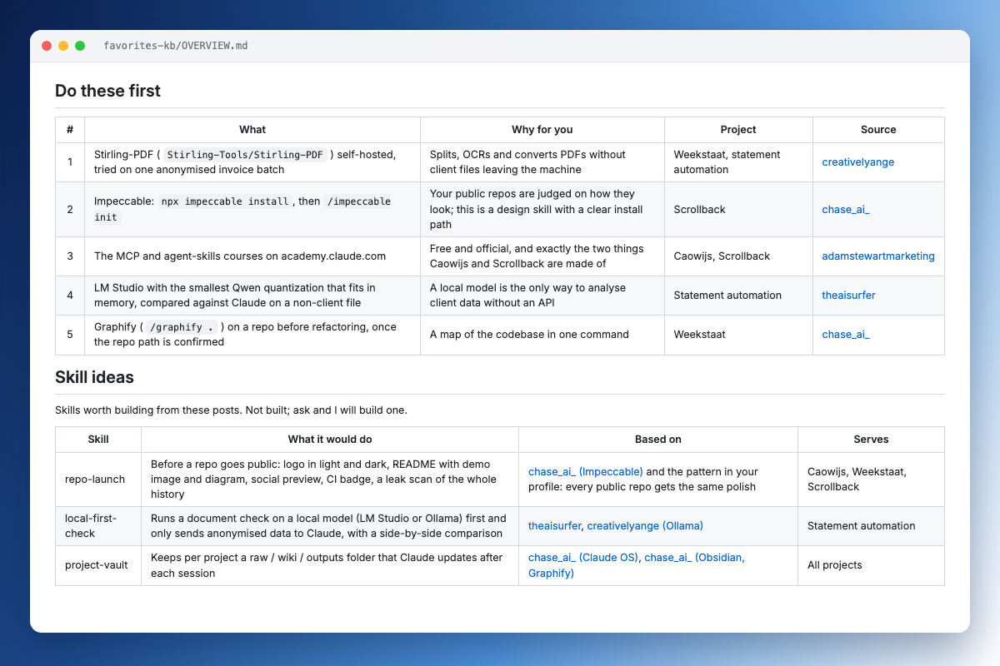
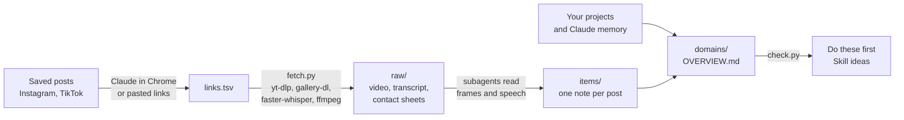

<p align="center">
  
</p>

<h1 align="center">Scrollback</h1>

<p align="center">
  Turn the posts you saved on Instagram and TikTok into a knowledge base you will actually use.
</p>

<p align="center">
  <a href="https://github.com/t1mvdploeg/scrollback/actions/workflows/test.yml"></a>
  
  
  
</p>



You save dozens of reels about tools, workflows and tricks, and never look at them again. Scrollback reads them all, the speech and the text on screen, and tells you which ones are worth acting on, for which of your own projects.

It is a Claude Code plugin: one skill that walks Claude through five phases, plus two small scripts for the work that should not burn tokens.

## Start

In Claude Code:

```
/plugin marketplace add t1mvdploeg/scrollback
/plugin install scrollback@scrollback
```

Then ask *"process my saved Instagram collection AI"*, or run `/scrollback:scrollback`.

You need [ffmpeg](https://ffmpeg.org/download.html) and [uv](https://docs.astral.sh/uv/getting-started/installation/). Collecting links by scrolling needs [Claude in Chrome](https://claude.com/chrome); pasting links works without it.

## What you get

| File | What is in it |
| --- | --- |
| `items/<id>.md` | One note per post: what is explained, every tool, repo and link mentioned, the core claim, and how useful it really is |
| `domains/*.md` | Posts grouped by topic, the best source picked where posts overlap, and which tip fits which of your projects |
| `OVERVIEW.md` | **Do these first** (the actions with the most value for you), **Skill ideas** (skills worth building from what you saved), and what stood out |

Notes call out what posts like to hide: a link behind "comment X", undisclosed promotion, a transcript that is just music. Add newly saved posts later and only those are processed.

## How it works



1. **Profile.** Claude reads your projects folder (READMEs, manifests, last commit), your `CLAUDE.md` and memory files, and your installed skills and plugins. You confirm the result.
2. **Links.** Claude scrolls your saved collection in Chrome, or you paste links.
3. **Fetch.** Each post is downloaded, its speech transcribed locally, and its frames laid out as contact sheets, because names and commands are often only on screen.
4. **Notes.** Subagents read caption, transcript and frames and write one note per post.
5. **Synthesis.** Claude groups the notes, judges overlap, ties tips to your projects, and `check.py` verifies that every post sits in exactly one domain and every link works.

Everything is written to a folder you choose, by default `./favorites-kb/`, and stays on your machine.

## What it does not do

- It does not install or test the tools mentioned in posts. "Winner" means the best source, not the proven best tool.
- It does not publish anything. The `raw/` folder holds other people's videos; keep it to yourself.
- It does not log in for you. Posts that need a login use your browser's cookies, and only after you agree.
- It does not build the suggested skills unless you ask.

## Tests

```
uv run --no-project --with pytest pytest
```

The tests cover the scripts (link parsing, captions, transcripts, interrupted downloads, the knowledge base check) and guard the repo against private paths. They do not download anything. CI runs them on Windows, macOS and Linux.

## License

MIT
